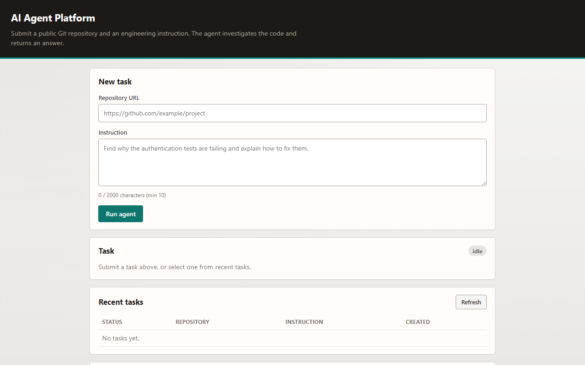
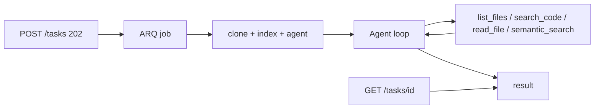
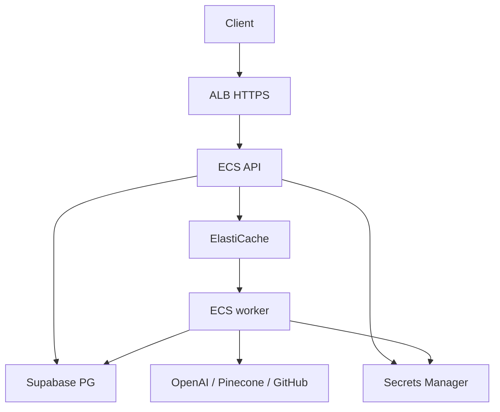

# AI Agent Platform

A deployed AI agent that asynchronously analyzes public Git repositories with LLM tool calling, semantic retrieval, background workers, persistent task state, and AWS infrastructure.

**Live demo:** [https://api.airepoagent.app](https://api.airepoagent.app) · [Swagger](https://api.airepoagent.app/docs) · [Health](https://api.airepoagent.app/health)



```text
Repository:  https://github.com/example/project
Instruction: Find why the authentication tests are failing and explain how to fix them.
```

**Status:** Phases 1–9 + deploy track 14a (ECS, ALB HTTPS). Working **demo**, not multi-tenant production — no app auth, no code-execution sandbox yet. Runbook: [infrastructure/aws/README.md](infrastructure/aws/README.md).

## How it works



1. `POST /tasks` → **202** + `task_id` (`pending`)
2. Worker clones, indexes (Pinecone), runs the agent
3. Agent uses repo tools until it answers or hits limits
4. Poll `GET /tasks/{id}` → `completed` / `failed`; runs at `GET /tasks/{id}/runs`

## API examples

```bash
curl -s -X POST https://api.airepoagent.app/tasks \
  -H 'Content-Type: application/json' \
  -d '{
    "repository_url": "https://github.com/microsoft/python-sample-vscode-fastapi-tutorial",
    "instruction": "Identify the main entry point and API routes. Cite file paths. Do not modify files."
  }'
```

```json
{
  "task_id": "a1b2c3d4-e5f6-7890-abcd-ef1234567890",
  "status": "pending",
  "repository_url": "https://github.com/microsoft/python-sample-vscode-fastapi-tutorial",
  "instruction": "Identify the main entry point...",
  "created_at": "2026-09-20T12:00:00.000000Z",
  "result": null,
  "error": null
}
```

```bash
curl -s https://api.airepoagent.app/tasks/<task_id>
# → status: running | completed | failed; result when done
curl -s https://api.airepoagent.app/tasks/<task_id>/runs
```

`POST /tasks/{id}/run` → **410 Gone**. OpenAPI: `/docs`.

## AWS



ECS API + worker, ALB/ACM, Redis (ARQ), Supabase, Pinecone, Secrets Manager, CloudWatch. Details: [infrastructure/aws/README.md](infrastructure/aws/README.md), [docs/deploy-track.md](docs/deploy-track.md).

**Demo tradeoffs:** public ECS subnets (no NAT); **no authentication**.

## Security

Repo content is untrusted (code + text). In place: URL/SSRF allow-list, path/symlink confinement, clone size/timeout, tool + agent limits, audit rows (`agent_runs` / `tool_calls`), secrets only from env/Secrets Manager. Details: [docs/security.md](docs/security.md).

## Limitations

- No auth / multi-tenant isolation
- No Docker sandbox (read-only analysis only)
- Eval harness exists ([`evals/`](evals/)); report template: [docs/evaluation-report.md](docs/evaluation-report.md) — results not committed yet
- Public demo can incur LLM/vector cost; no Langfuse/OTel yet

## Docs

| Doc | |
| --- | --- |
| [architecture.md](docs/architecture.md) | As-built system |
| [security.md](docs/security.md) | Threat model |
| [agent-design.md](docs/agent-design.md) | Tool loop |
| [evaluation.md](docs/evaluation.md) / [evals/](evals/) | Eval design + harness |
| [roadmap.md](docs/roadmap.md) / [decisions.md](docs/decisions.md) | Phases / ADRs |
| [deploy-track.md](docs/deploy-track.md) / [aws README](infrastructure/aws/README.md) | Deploy |

## Stack

Python 3.12 · FastAPI · Postgres/Supabase · Redis/ARQ · Git + ripgrep · OpenAI · Pinecone · ECS/ALB. Static demo at `/`; no LangChain.

## Local

```bash
cd backend
uv sync && cp .env.example .env
uv run uvicorn app.main:app --reload          # http://127.0.0.1:8000/
uv run arq app.workers.main.WorkerSettings    # worker
uv run pytest
```

Needs: Postgres, Redis, `git`, `rg`. Optional: OpenAI, Pinecone. Compose: [docker-compose.yml](docker-compose.yml). Env names: [`.env.example`](backend/.env.example). Never commit secrets.

**CI:** [`.github/workflows/ci.yml`](.github/workflows/ci.yml) — pytest + Docker build.

**Eval (paid, deliberate):**

```bash
cd backend && uv run --with pyyaml python ../evals/run_eval.py --api-base http://127.0.0.1:8000 --all
```
