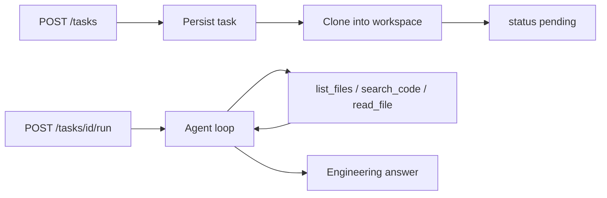

# AI Agent Platform

A backend-first AI software engineering assistant. Give it a Git repository URL and a natural-language engineering instruction; it clones the repository into an isolated workspace, investigates the code through a controlled set of tools, and returns an engineering answer.

```text
Repository:  https://github.com/example/project
Instruction: Find why the authentication tests are failing and explain how to fix them.
```

## Status

Phases 1–6 are complete in code. The MVP is live: `POST /tasks` clones, then `POST /tasks/{task_id}/run` investigates the workspace with the OpenAI Responses API and returns an engineering answer.

Next: Phase 7 (persist `agent_runs` / `tool_calls`) — see [docs/phases/phase-07.md](docs/phases/phase-07.md). Live-run hardening notes: [docs/agent-optimization.md](docs/agent-optimization.md).

## What it does



The agent investigates rather than guesses: it lists directories, searches the code, reads the files that matter, and grounds its answer in what it actually found. Later phases add semantic retrieval, sandboxed test execution, and the ability to modify code and return a reviewable diff.

## Documentation

| Document | Contents |
| --- | --- |
| [docs/architecture.md](docs/architecture.md) | Target architecture, layer separation, data model, technology constraints |
| [docs/agent-design.md](docs/agent-design.md) | The tool-calling loop, tool contract, tool catalog, safeguards |
| [docs/security.md](docs/security.md) | Threat model and controls; repository code is untrusted input |
| [docs/evaluation.md](docs/evaluation.md) | Metrics, benchmark task set, grading approach |
| [docs/decisions.md](docs/decisions.md) | Settled decisions, open items, accepted technical debt |
| [docs/roadmap.md](docs/roadmap.md) | All 15 phases with definitions of done |
| [docs/phases/phase-07.md](docs/phases/phase-07.md) | Active Phase 7 specification (agent run persistence) |
| [docs/agent-optimization.md](docs/agent-optimization.md) | Live-run lessons: prompts, models, dispatch cache, reasoning replay |

Start with [docs/phases/phase-07.md](docs/phases/phase-07.md) for the next implementation step.

## Technology

| Area | Choice | From phase |
| --- | --- | --- |
| Language | Python 3.12+ | 1 |
| Dependencies | `uv`, `pyproject.toml`, `uv.lock` | 1 |
| API | FastAPI, Pydantic v2, Uvicorn | 1 |
| Database | PostgreSQL (local apt for dev; Supabase for prod), SQLAlchemy 2.x, Alembic | 3 |
| Repository access | Git CLI | 4 |
| Code search | ripgrep | 5 |
| LLM | OpenAI Responses API, official SDK | 6 |
| Embeddings and vectors | OpenAI `text-embedding-3-small`, Pinecone | 8 |
| Background jobs | Redis, ARQ | 9 |
| Sandbox | Docker | 10 |
| Auth, optional | Supabase Auth, JWT | 12 |
| Observability | Langfuse, OpenTelemetry | 13 |
| Deployment | AWS ECS/Fargate, ECR, CloudWatch, GitHub Actions | 14 |

No frontend framework at any phase. Swagger UI at `/docs` is the demonstration surface. No LangChain or LangGraph in the initial implementation. See [docs/decisions.md](docs/decisions.md) for the reasoning and the rejected alternatives.

## Roadmap at a glance

| Phase | Name | | Phase | Name |
| --- | --- | --- | --- | --- |
| 1 | FastAPI foundation | | 9 | Background execution |
| 2 | Task API | | 10 | Docker sandbox |
| 3 | PostgreSQL via Supabase | | 11 | Code modification |
| 4 | Repository management | | 12 | Authentication, optional |
| 5 | Repository context tools | | 13 | Observability |
| 6 | OpenAI agent loop | | 14 | AWS deployment |
| 7 | Agent runs | | 15 | Production hardening |
| 8 | Semantic retrieval | | | |

**The MVP (Phase 6) is complete.** It needs no Redis, Docker, Pinecone, authentication, or agent framework. Default model: `gpt-5.4-mini` (override with `OPENAI_MODEL`).

## Prerequisites

| Requirement | Needed from | Notes |
| --- | --- | --- |
| Python 3.12+ | Phase 1 | |
| [`uv`](https://docs.astral.sh/uv/) | Phase 1 | Dependency and environment management |
| `git` | Phase 1 | Also the repository cloning mechanism from Phase 4 |
| `ripgrep` | Phase 5 | `sudo apt install ripgrep`; an editor-bundled `rg` is not sufficient |
| PostgreSQL connection | Phase 3 | Local apt Postgres for development (D19); Supabase is the production target (D6) |
| OpenAI API key | Phase 6 | |
| Pinecone account | Phase 8 | |
| Redis | Phase 9 | |
| Docker | Phase 10 | Currently unreachable from this WSL distribution; see [docs/decisions.md](docs/decisions.md) |

## Local setup

Available:

```bash
cd backend
uv sync                 # install dependencies from uv.lock
cp .env.example .env     # then edit as needed
```

## Development commands

```bash
cd backend

uv run uvicorn app.main:app --reload    # run the API at http://127.0.0.1:8000
uv run pytest                            # run the test suite
uv run pytest -v                         # verbose
uv add <package>                         # add a dependency
uv add --dev <package>                   # add a development dependency
```

Never create a `requirements.txt`. Dependencies are managed exclusively through `uv`, and `uv.lock` is committed.

## Environment variables

Set through the environment or a `.env` file in `backend/`. `.env` is git-ignored; `.env.example` carries names only, never values.

| Variable | From phase | Purpose |
| --- | --- | --- |
| `APP_ENV` | 1 | `local`, `test`, or `production` |
| `LOG_LEVEL` | 1 | Logging verbosity, default `INFO` |
| `DEBUG` | 1 | Debug behavior toggle, default `false` |
| `DATABASE_URL` | 3 | PostgreSQL connection string |
| `WORKSPACES_ROOT` | 4 | Directory holding cloned repository workspaces |
| `GIT_CLONE_TIMEOUT_SECONDS` | 4 | Clone timeout |
| `MAX_REPO_SIZE_MB` | 4 | Clone size cap |
| `GIT_ALLOWED_HOSTS` | 4 | Comma-separated clone host allow-list |
| `RIPGREP_PATH` | 5 | System `rg` binary name or path (not Cursor's bundled rg) |
| `TOOL_READ_MAX_BYTES` | 5 | Max bytes returned by `read_file` |
| `TOOL_READ_MAX_LINES` | 5 | Max lines returned by `read_file` |
| `TOOL_SEARCH_MAX_RESULTS` | 5 | Max matches returned by `search_code` |
| `TOOL_SEARCH_TIMEOUT_SECONDS` | 5 | ripgrep timeout |
| `TOOL_GIT_TIMEOUT_SECONDS` | 5 | Git tool timeout |
| `OPENAI_API_KEY` | 6 | OpenAI credential |
| `OPENAI_MODEL` | 6 | Model used by the agent loop |
| `AGENT_MAX_ITERATIONS` | 6 | Hard cap on agent loop turns |
| `AGENT_TIMEOUT_SECONDS` | 6 | Wall-clock limit per run |
| `AGENT_MAX_OUTPUT_TOKENS` | 6 | Optional per-response output cap |
| `AGENT_TOKEN_BUDGET` | 6 | Optional cumulative token halt (`0` = disabled) |
| `OPENAI_EMBEDDING_MODEL` | 8 | Embedding model, default `text-embedding-3-small` |
| `PINECONE_API_KEY` | 8 | Pinecone credential |
| `PINECONE_INDEX` | 8 | Pinecone index name |
| `REDIS_URL` | 9 | Queue connection |
| `SUPABASE_URL` | 12 | Auth issuer |
| `SUPABASE_JWT_SECRET` | 12 | Token verification |
| `LANGFUSE_PUBLIC_KEY` | 13 | Tracing |
| `LANGFUSE_SECRET_KEY` | 13 | Tracing |
| `LANGFUSE_HOST` | 13 | Tracing endpoint |
| `OTEL_EXPORTER_OTLP_ENDPOINT` | 13 | OpenTelemetry collector |

No secret is ever committed, logged, stored in a database row, or passed into the sandbox. See [docs/security.md](docs/security.md).

## Testing

```bash
cd backend
uv run pytest
```

Three levels, described in [docs/evaluation.md](docs/evaluation.md): unit tests for deterministic logic, integration tests for components in combination, and agent evaluations that run the full loop against a real model. Only the first two belong in CI; agent evaluations cost money and are run deliberately. No unit or integration test makes a paid API call.

## Project structure

```text
ai-agent-platform/
├── docs/                  Architecture, design, security, evaluation, roadmap
├── backend/               FastAPI application and tests (from Phase 1)
├── infrastructure/        Docker and AWS definitions (from Phase 14)
└── .github/workflows/     CI and deployment (from Phase 14)
```

Directories appear in the phase that needs them. Placeholder modules are not created in advance.

## Development principles

1. Implement one phase at a time; every phase produces working software.
2. Do not create fake implementations of future components.
3. Repository code and content are untrusted input, both as code to execute and as text entering the model's context.
4. The LLM never executes arbitrary code directly; it requests tools, and the platform decides whether to honor them.
5. Every infrastructure component must have a concrete, current purpose.
6. Do not silently change a technology decision. Raise the conflict, then record the change in [docs/decisions.md](docs/decisions.md).

## Security

This platform executes AI-selected actions against software repositories, and from Phase 10 it executes untrusted code. Read [docs/security.md](docs/security.md) before working on the tool, sandbox, or repository layers.
