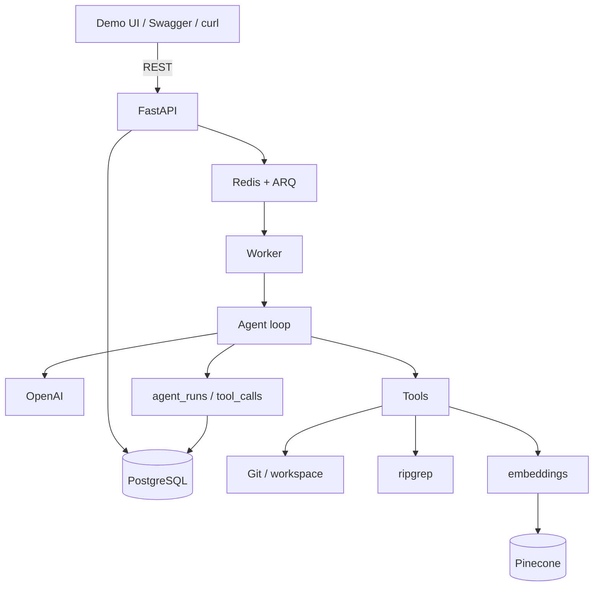
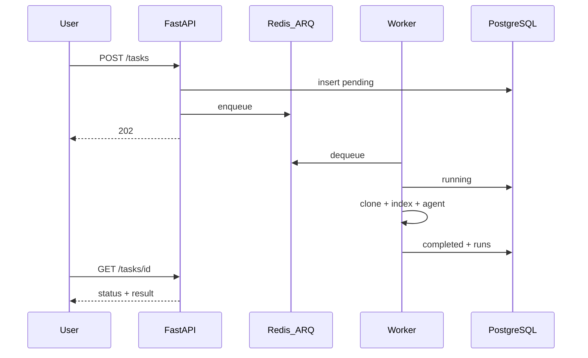
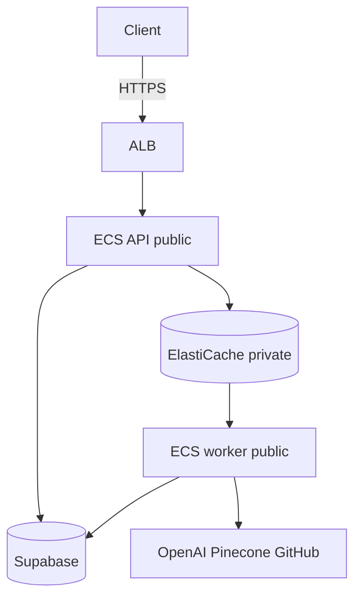

# Architecture

As-built overview (Phases 1–9 + deploy track 14a). Roadmap: [roadmap.md](roadmap.md). Decisions: [decisions.md](decisions.md).

**Status:** Implemented in `backend/`; live on AWS (`eu-north-1`). Next: Phase 10 sandbox and/or 14b. Index: [roadmap.md](roadmap.md).

## Diagram



Not built yet: sandbox (10), code mods (11), auth (12), Langfuse/OTel (13), OIDC deploy (14b).

## Security boundaries

```text
Internet → ALB HTTPS → ECS API → Redis → ECS worker
                         ↓                  ↓
                    Supabase PG      OpenAI / Pinecone / GitHub
```

| Boundary | Status | Where |
| --- | --- | --- |
| HTTPS | Yes (ALB + ACM) | 14a |
| App auth | **No** (public demo) | Phase 12 |
| SSRF / URL allow-list | Yes | `url_validation.py` |
| Path / symlink confinement | Yes | `tools/paths.py` |
| Clone size / timeout | Yes | repository service |
| Tool + agent limits | Yes | tools / `agent/limits.py` |
| Audit trail | Yes | `agent_runs` / `tool_calls` |
| Code sandbox | **No** | Phase 10 |
| Rate limits | **No** | Phase 15 |

Full model: [security.md](security.md).

## Layers

A layer only depends downward through explicit interfaces.

| Layer | Role | Phase |
| --- | --- | --- |
| API | HTTP, validation, errors | 1–2 |
| Agent | Loop, tool selection | 6 |
| Tool | Typed capabilities | 5 |
| Repository | Clone, workspace | 4 |
| Retrieval | ripgrep + semantic | 5, 8 |
| Sandbox | Isolated exec | 10 |
| Persistence | PostgreSQL | 3 |

Rules: routes → services only; agent → tools only; tools never call OpenAI; retrieval does not know about agents.

## Components (short)

| Piece | Notes |
| --- | --- |
| **API** | FastAPI; static demo at `/`; Swagger at `/docs`. `POST /tasks` → **202**; poll `GET /tasks/{id}`; `/run` → **410**; run history under `/runs`. |
| **DB** | SQLAlchemy + Alembic; local apt Postgres (dev), Supabase (prod). Models in `app/database/`. |
| **Repos** | URL validation, clone, workspace. Public repos only. |
| **Tools** | Validated args; workspace-confined. Catalog: [agent-design.md](agent-design.md). |
| **Agent** | OpenAI Responses tool calling in the worker (`TaskService.process`). Limits + live notes: [agent-optimization.md](agent-optimization.md). |
| **Retrieval** | ripgrep (exact) + Pinecone namespace `task-{id}` (semantic). |
| **Queue** | Redis + ARQ. |
| **Sandbox / OTel** | Planned (10 / 13). |

## Current request flow



## Cloud (14a)



Public Fargate + IGW (no NAT); Redis private; secrets from Secrets Manager; inventory: [infrastructure/aws/README.md](../infrastructure/aws/README.md).

## Data model

`tasks` → `agent_runs` → `tool_calls`. Optional `users` in Phase 12. Status: `pending` \| `running` \| `completed` \| `failed`. No secrets in tables. Schema = Alembic migrations.

## Layout

```text
backend/app/{api,agent,tools,repositories,retrieval,queue,workers,database,llm}/
backend/static/          demo UI
evals/                   evaluation harness
.github/workflows/ci.yml
infrastructure/aws/
docs/                          # public docs; phase specs in phases/ are local-only
```

## Constraints

| Area | Choice |
| --- | --- |
| Lang / deps | Python 3.12+, `uv` (no `requirements.txt`) |
| API | FastAPI + Pydantic v2 |
| LLM | OpenAI Responses SDK (no LangChain) |
| Vectors | `text-embedding-3-small` + Pinecone |
| DB / queue | Postgres; Redis + ARQ |
| Sandbox / auth / OTel | Docker (10); Supabase JWT (12); Langfuse/OTel (13) |
| UI / cloud | Static demo + Swagger; app infra on AWS; Supabase/Pinecone/OpenAI stay external |

## Principles

1. FastAPI owns the app; vendors are dependencies.
2. LLM requests tools; platform decides.
3. Tools are typed and permissioned; repo input is untrusted.
4. Keep layers; add infra only when needed.
5. State in Postgres, not Pinecone.
