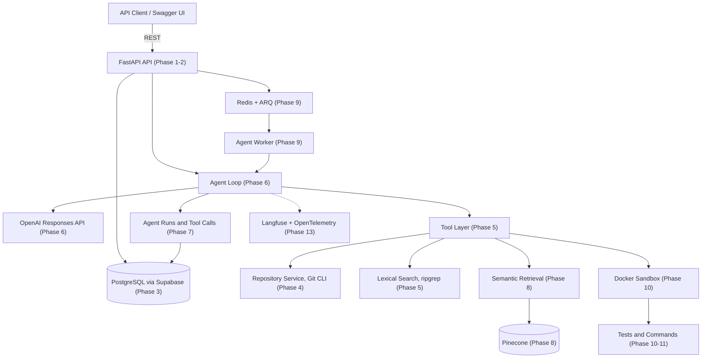
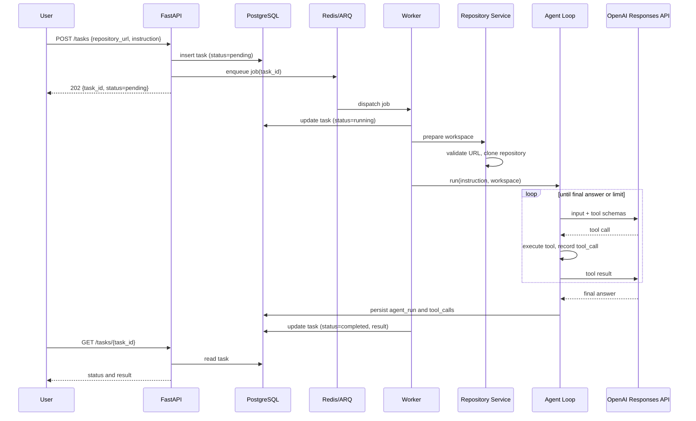
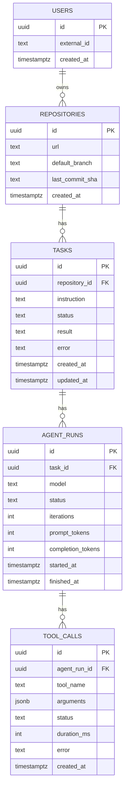

# Architecture

## Purpose

The AI Agent Platform is a backend-first AI software engineering assistant. A user supplies a Git repository URL and a natural-language engineering instruction. The platform clones the repository into an isolated workspace, lets an LLM investigate it through a controlled set of tools, and returns an engineering result.

Example instruction:

```text
Repository:  https://github.com/example/project
Instruction: Find why the authentication tests are failing and explain how to fix them.
```

This document describes the target architecture. Every component is annotated with the phase that introduces it. Components marked with a future phase do not exist in the codebase yet, and no placeholder modules are created for them. See [roadmap.md](roadmap.md) for the phase sequence and [decisions.md](decisions.md) for the rationale behind each technology choice.

## Status

Documentation only. Phase 1 has not started. No application code exists in this repository yet.

## Target architecture



## Layer separation

The system is divided into six layers. A layer may depend on the layers below it through an explicit interface, and never reaches sideways into a peer's internals. This is the single most important structural rule in the project, because it is what allows the sandbox and persistence layers to be replaced without touching agent logic.

| Layer | Responsibility | Introduced |
| --- | --- | --- |
| API | HTTP surface, request validation, response shaping, error mapping | Phase 1-2 |
| Agent | Reasoning loop, tool selection, run lifecycle | Phase 6 |
| Tool | Typed, permission-controlled capabilities exposed to the model | Phase 5 |
| Repository | Cloning, workspace lifecycle, Git inspection | Phase 4 |
| Retrieval | Lexical and semantic code search | Phase 5 and Phase 8 |
| Execution / Sandbox | Isolated command and test execution | Phase 10 |
| Persistence | Application state in PostgreSQL | Phase 3 |

Concrete consequences of the rule:

- API routes never invoke the Git CLI, never construct prompts, and never touch a session directly. They call services.
- The agent loop never calls `subprocess` and never opens files by path. It calls tools.
- Tools never call the OpenAI API. They receive validated arguments and return structured results.
- The retrieval layer does not know that an agent exists. It answers queries.

## Component responsibilities

### FastAPI API (Phase 1-2)

The application layer and the only public entry point. Owns routing, request and response schemas, dependency injection, error mapping, and OpenAPI documentation. Swagger UI at `/docs` is the demonstration surface for this project; there is no separate frontend at any phase.

Endpoints as they accumulate:

```text
GET  /health              Phase 1
POST /tasks               Phase 2
GET  /tasks/{task_id}     Phase 9 (status polling for asynchronous runs)
```

### Persistence (Phase 3)

PostgreSQL, provisioned as a managed Supabase database. Supabase is used as PostgreSQL and, optionally and much later, as an authentication provider. It is not the application backend; all business logic stays in FastAPI. Access is through SQLAlchemy 2.x with Alembic migrations. Database logic lives in a repository/service module, not in route handlers.

### Repository service (Phase 4)

Owns the lifecycle of a cloned repository: URL validation, isolated workspace creation, cloning through the Git CLI, structure inspection, and cleanup. Git invocation is confined to this layer so the rest of the application never shells out to Git directly. Only public repositories are supported until authentication and repository credentials exist.

### Tool layer (Phase 5)

Each tool has a name, a description used by the model, a JSON Schema for its input, a typed output, and an explicit error representation. Tools validate their own inputs and confine all filesystem access to the task's workspace root. Read-only tools and mutating tools are separated, so write access introduced in Phase 11 is a deliberate capability grant rather than an accident. See [agent-design.md](agent-design.md) for the full contract and catalog.

### Agent loop (Phase 6)

Implemented directly against the OpenAI Responses API with native tool calling, deliberately framework-light. The loop sends the instruction and tool schemas, detects tool calls, dispatches them, feeds results back, and repeats until the model produces a final answer or a safeguard limit is reached.

### Retrieval (Phase 5 and Phase 8)

Two complementary tracks, not competing ones. Lexical search with ripgrep arrives in Phase 5 and remains permanently useful, because exact identifier and string matching is often what a code question actually requires. Semantic search with OpenAI embeddings and Pinecone arrives in Phase 8 for conceptual queries where the user's wording does not match the source text. Vector search is not assumed to be the only or best way to retrieve code.

### Background execution (Phase 9)

Redis with ARQ. `POST /tasks` persists the task, enqueues a job, and returns a task identifier immediately rather than holding an HTTP connection open for the duration of an agent run. A worker process executes the agent and updates task status and results.

### Sandbox (Phase 10)

Docker-based isolated execution for `run_command` and `run_tests`. Repository code is untrusted and must never execute on the application host. Requirements include CPU and memory limits, execution timeouts, filesystem isolation, restricted networking, no access to application secrets, no privileged containers, and guaranteed cleanup. See [security.md](security.md).

### Observability (Phase 13)

Langfuse for LLM and agent tracing, OpenTelemetry for application-level traces and metrics. Tracks agent runs, model calls, tool calls, latency, token usage, errors, and estimated cost.

## Request-to-result data flow

The flow below is the state after Phase 9, when execution is asynchronous. Before that, the agent runs inline within the request.



## Data model sketch

Introduced in Phase 3, extended in Phase 7, and extended again in the optional Phase 12. Column lists are indicative, not final; the authoritative schema is whatever Alembic migrations define.



Notes:

- `users` is created only in Phase 12, when multi-user behavior is actually needed. Until then, repositories and tasks have no owner.
- `tasks.status` is one of `pending`, `running`, `completed`, `failed`.
- No secrets, tokens, or credentials are stored in any table. See [security.md](security.md).

## Repository layout

Current layout:

```text
ai-agent-platform/
├── .gitignore
├── README.md
└── docs/
    ├── architecture.md
    ├── agent-design.md
    ├── security.md
    ├── evaluation.md
    ├── decisions.md
    ├── roadmap.md
    └── phases/
        └── phase-01.md
```

Target layout, reached incrementally. Directories appear only in the phase that needs them:

```text
ai-agent-platform/
├── backend/
│   ├── app/
│   │   ├── main.py                 Phase 1
│   │   ├── config.py               Phase 1
│   │   ├── logging.py              Phase 1
│   │   ├── errors.py               Phase 1
│   │   ├── api/routes/             Phase 1-2
│   │   ├── schemas/                Phase 2
│   │   ├── services/               Phase 2
│   │   ├── database/               Phase 3
│   │   ├── repositories/           Phase 4
│   │   ├── tools/                  Phase 5
│   │   ├── agent/                  Phase 6
│   │   ├── retrieval/              Phase 8
│   │   ├── workers/                Phase 9
│   │   ├── sandbox/                Phase 10
│   │   └── observability/          Phase 13
│   ├── tests/                      Phase 1
│   ├── pyproject.toml              Phase 1
│   └── uv.lock                     Phase 1
├── infrastructure/                 Phase 14
├── .github/workflows/              Phase 14
└── docs/
```

## Binding technology constraints

These are project constraints. They are not defaults to be revisited casually. Changing one requires updating [decisions.md](decisions.md) with the reason.

| Area | Decision | Constraint |
| --- | --- | --- |
| Language | Python 3.12+ | — |
| Dependencies | `uv` with `pyproject.toml` and `uv.lock` | Never create `requirements.txt` |
| Web framework | FastAPI with Pydantic v2 | — |
| LLM interface | OpenAI Responses API via the official SDK | No LangChain or LangGraph in the initial implementation |
| Embeddings | OpenAI `text-embedding-3-small` | Not before Phase 8 |
| Vector store | Pinecone | Not before Phase 8; complements ripgrep rather than replacing it |
| Database | PostgreSQL via Supabase, SQLAlchemy 2.x, Alembic | Not before Phase 3 |
| Queue | Redis with ARQ | Not before Phase 9; not Celery |
| Sandbox | Docker | Not before Phase 10; no unrestricted host shell execution ever |
| Auth | Supabase Auth with JWT, optional | Not before Phase 12; no custom password authentication |
| Observability | Langfuse and OpenTelemetry | Not before Phase 13 |
| Frontend | None | No Next.js, no Vercel; Swagger UI is the demonstration surface |
| Cloud | AWS for application infrastructure | Managed third-party services remain external |

The last row deserves emphasis: "use AWS" means the application's own infrastructure is deployed on AWS. It does not mean every third-party service must be replaced with an AWS equivalent. Supabase, Pinecone, OpenAI, and GitHub remain external services.

## Design principles

1. Keep FastAPI as the application layer. External managed services are dependencies, not the backend.
2. The LLM never executes arbitrary code directly. It requests tool calls; the platform decides whether and how to honor them.
3. Tools are explicit, typed, and permission-controlled.
4. Repository code and content are untrusted input.
5. Maintain the layer separation described above.
6. Start with a simple custom agent loop. Adopt a framework only when the workflow demonstrably justifies it.
7. Use Pinecone only where semantic retrieval provides real value over lexical search.
8. Application state lives in PostgreSQL, never in Pinecone.
9. Do not add authentication until multi-user functionality requires it.
10. Do not build a frontend.
11. Prefer incremental complexity. Every infrastructure component must have a concrete, current purpose.
12. The MVP must be runnable locally with minimal external infrastructure: Python, git, ripgrep, and an OpenAI API key.
