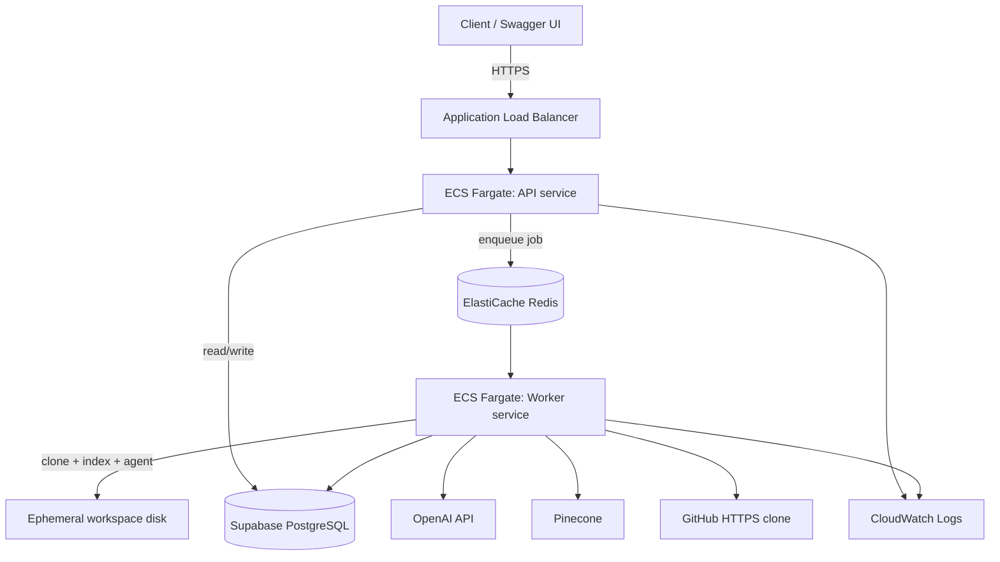

# Deploy track (after Phases 8–9)

## Purpose

This document is the canonical guide for deploying the AI Agent Platform to AWS. **Phases 8–9 are complete in code;** this track is the active next step. It encodes an intentional reordering of the roadmap: learn ECS, workers, and Redis in production before Phase 10 (Docker sandbox).

Rationale:

- Phase 9 makes the API return quickly (`202`) while a worker runs clone, indexing, and the agent loop — the right shape for cloud deployment.
- The read-only agent (Phases 1–9) is deployable without Phase 10; sandbox is required only for `run_command` / `run_tests`.
- O1 (Docker unreachable in WSL) blocks Phase 10 locally anyway; the deploy track does not depend on fixing O1.
- A minimal AWS deploy overlaps with Phase 14; doing it early is **14a** (see [roadmap.md](roadmap.md)). Full Phase 14 hardening (**14b**) follows after the first successful E2E cloud run.

See [decisions.md](decisions.md) D23–D26 for settled choices.

## Prerequisites

| Requirement | Status |
| --- | --- |
| Phases 1–7 implemented | Complete |
| Phase 8 — semantic retrieval, `semantic_search` tool | Complete |
| Phase 9 — ARQ worker, Redis, `POST /tasks` → 202, polling | Complete |
| Supabase project (or other managed Postgres) | For cloud `DATABASE_URL` |
| Pinecone index | Needed for cloud indexing |
| OpenAI API key | Needed for agent + embeddings |
| AWS account | For ECS, ALB, ElastiCache, ECR, Secrets Manager |
| GitHub repo with Actions (optional) | For CI build → ECR when O1 blocks local Docker |

Phases 8–9 are done. Start at **step B** (Supabase).

## What stays external

These services are **not** replaced with AWS equivalents in the first deploy:

| Service | Role |
| --- | --- |
| **Supabase** | Managed PostgreSQL (`DATABASE_URL` only; no Supabase Auth until Phase 12) |
| **OpenAI** | LLM and embeddings |
| **Pinecone** | Vector store (Phase 8) |
| **GitHub** | Public repository clones at runtime |

**Not in v1:** RDS (deferred per D24), self-hosted Postgres in the app container, Langfuse (Phase 13).

## Target architecture



- **Two ECS services** from the **same container image**: API runs Uvicorn; worker runs ARQ with a different command.
- **Redis** is ElastiCache in AWS; local Redis or compose Redis for parity testing.
- **Postgres** is Supabase over TLS; credentials in AWS Secrets Manager, injected as env vars at task start.
- **Workspaces** live on ephemeral Fargate task disk (accepted debt; EFS deferred).

## Environment matrix

| Environment | `DATABASE_URL` | Redis | Notes |
| --- | --- | --- | --- |
| Local dev (D19) | apt Postgres `@127.0.0.1` | Required (`REDIS_URL`) for enqueue + worker | Unchanged Postgres; Redis needed for async flow |
| Docker Compose | Supabase **or** compose Postgres | `redis://redis:6379/0` | Parity testing before AWS |
| AWS (deploy track) | Supabase direct URL via Secrets Manager | ElastiCache endpoint (`REDIS_URL`) | `?sslmode=require` on Postgres URL |

Local development can keep apt Postgres (D19). Cloud uses Supabase (D6, D24) with **no application code changes** — only `DATABASE_URL`.

## Step-by-step track

Implementation order for the deploy track (reference only; details land in phase specs and infrastructure docs):

### A — Phase 8 and Phase 9 locally — **done**

- Phase 8: [phases/phase-08.md](phases/phase-08.md) — chunking, embeddings, Pinecone, `semantic_search`.
- Phase 9: [phases/phase-09.md](phases/phase-09.md) — ARQ, Redis, `POST /tasks` returns **202**, worker runs clone + `ensure_indexed` + agent; clients poll `GET /tasks/{task_id}`.
- Worker entry: `uv run arq app.workers.main.WorkerSettings`.

### B — Supabase provision and migrations

1. Create a Supabase project.
2. Copy the **direct** connection string (not the transaction pooler for first deploy; see O7 in [decisions.md](decisions.md)).
3. Append `?sslmode=require` if not present.
4. From a machine with network access to Supabase:
   ```bash
   cd backend
   DATABASE_URL='postgresql+psycopg://...' uv run alembic upgrade head
   ```
5. Store the same URL in AWS Secrets Manager for ECS tasks (never commit it).

### C — Containerize (app image, not sandbox)

- `backend/Dockerfile`: Python 3.12, `uv`, install deps from lockfile; include **git** and **ripgrep** in the image.
- `docker-compose.yml`: services `api`, `worker`, `redis`; optional local Postgres or point `DATABASE_URL` at Supabase.
- API command: `uv run uvicorn app.main:app --host 0.0.0.0 --port 8000`
- Worker command: `uv run arq app.workers.main.WorkerSettings`
- **Do not** put Postgres inside the backend image (D24).

**O1 workaround:** if Docker is unreachable in WSL, build and push images via GitHub Actions → ECR; deploy from ECR to ECS.

### D — Minimal AWS

| Resource | Purpose |
| --- | --- |
| ECR | Container image registry |
| ECS Fargate | `api` and `worker` services (smallest CPU/memory for learning) |
| Application Load Balancer | HTTPS termination, health checks on API |
| ElastiCache Redis | ARQ queue |
| Secrets Manager | `DATABASE_URL`, `REDIS_URL`, `OPENAI_API_KEY`, `PINECONE_*`, etc. |
| CloudWatch | Logs from both services |
| Security groups | ALB → API only; worker has **no inbound** ports; DB/Redis from task SGs only |

No Terraform/CDK required for v1; console or CLI is acceptable for learning. See [infrastructure/aws/README.md](../infrastructure/aws/README.md).

### E — E2E verification

Use the checklist in [Verification checklist](#verification-checklist) below.

### F — Phase 14 hardening (subset)

Before calling Phase 14 “complete”, add:

- GitHub Actions: test on PR; OIDC deploy to ECR/ECS (no long-lived AWS keys in repo).
- IAM task roles (least privilege; secrets read-only).
- Documented networking, cost estimate, and teardown steps in [infrastructure/aws/README.md](../infrastructure/aws/README.md).

This is **14b**; **14a** is the minimal deploy in step D.

### G — Return to Phase 10

Resume [roadmap.md](roadmap.md) Phase 10 (Docker sandbox) after deploy track goals are met. Fix O1 (Docker in WSL) on a machine where sandbox development is possible. App containerization (D25) is unrelated to `sandbox.Dockerfile`.

## Supabase setup

1. **Create project** at [supabase.com](https://supabase.com).
2. **Database settings** → Connection string → **URI** (direct connection to `db.<project>.supabase.co`).
3. Use the `postgresql+psycopg://` form expected by SQLAlchemy/psycopg v3.
4. Run Alembic once against this URL before pointing ECS at it.
5. **Pooler (O7):** defer transaction-pooler tuning until Phase 14b; first deploy uses direct connection.

Supabase Auth is **not** enabled for the deploy track (Phase 12).

## Container notes

| Topic | Guidance |
| --- | --- |
| System binaries | `git`, `ripgrep` must be in the image (D14, D21). |
| One image, two roles | Same image; override `CMD` for API vs worker. |
| Secrets | Inject at runtime from Secrets Manager; never `ARG` or `ENV` bake secrets into layers. |
| Non-root user | Run container as non-root user (Phase 14 DoD). |
| WSL Docker (O1) | Build in CI → push to ECR if local `docker build` fails. |

## Workspaces on Fargate

- **v1:** clone into the task’s ephemeral filesystem (`WORKSPACES_ROOT` on local disk).
- **Cost:** clones are lost when the worker task is replaced; acceptable for learning and read-only analysis.
- **Repay:** EFS mount or dedicated worker volume in Phase 14b/15 (see accepted debt in [decisions.md](decisions.md)).

## Security (first deploy)

Full posture: [security.md](security.md#first-cloud-deploy-posture). Summary:

- Restrict ALB access (VPN, IP allow-list, or private ALB + bastion); do not expose an unauthenticated agent API to `0.0.0.0/0`.
- Supabase and external APIs over TLS; credentials only in Secrets Manager.
- Worker service: no inbound security group rules.
- Phase 12 auth is deferred; network restriction is the primary control.

## Verification checklist

After deploy track step D, confirm:

- [ ] `GET /health` via ALB returns `{"status":"ok"}`.
- [ ] `POST /tasks` with a public GitHub URL returns **202** and a `TaskResponse` with `task_id` and `status: pending` (or `running` once worker picks up).
- [ ] `GET /tasks/{task_id}` eventually shows `completed` with a non-empty `result`.
- [ ] Supabase `tasks` row exists for the task; `agent_runs` and `tool_calls` rows exist (Phase 7).
- [ ] CloudWatch shows worker logs: clone, indexing (Phase 8), agent iterations.
- [ ] Pinecone namespace created for the task (`task-{task_id}`) if indexing enabled.
- [ ] No secrets appear in logs or task/run rows.
- [ ] Failed clone or bad URL surfaces `failed` status with error, not a stuck `running`.

## Cost and teardown

- **Smallest practical:** one Fargate task each for API and worker (0.25 vCPU / 0.5 GB or similar), single-node ElastiCache, ALB hourly charge.
- **External:** Supabase free tier may suffice for learning; OpenAI and Pinecone usage is usage-based.
- **Teardown:** delete ECS services, ALB, ElastiCache, ECR images, and Secrets Manager entries when not learning to avoid ongoing cost.

## Return to roadmap

Recommended phase order for this project:

```text
Phases 8 → 9 → Deploy track (14a) → Phase 10 → 11 → … → Phase 14b completion → 15
```

- Phase 10 is **not blocked** by the deploy track but is **paused** until deploy learning goals are met and O1 is resolved for sandbox work.
- Phase 14 is split: **14a** = this deploy track; **14b** = OIDC CI, IAM hardening, pooler verification (O7), full documentation.

## Related documents

| Document | Contents |
| --- | --- |
| [roadmap.md](roadmap.md) | Phase index and deploy track section |
| [architecture.md](architecture.md) | Cloud topology and async flow diagrams |
| [decisions.md](decisions.md) | D23–D26, accepted debt |
| [phases/phase-09.md](phases/phase-09.md) | Worker and queue specification |
| [infrastructure/aws/README.md](../infrastructure/aws/README.md) | AWS runbook stub |
