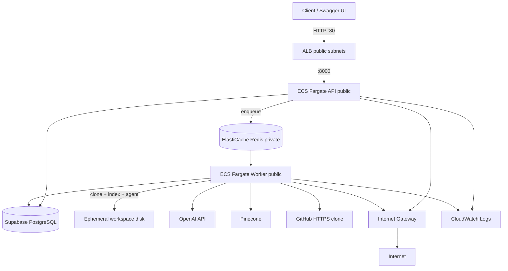

# Deploy track (after Phases 8–9)

## Purpose

Canonical guide for deploying the AI Agent Platform to AWS after Phases 8–9. Intentional roadmap reorder: learn ECS, workers, and Redis in production before Phase 10 (Docker sandbox).

**Status: 14a complete.** Steps A–E are done (code, Supabase, containerize, AWS Console deploy, E2E). Live inventory and runbook: [infrastructure/aws/README.md](../infrastructure/aws/README.md). Next: Phase 10 (sandbox) and/or **14b** hardening.

Rationale:

- Phase 9 returns `202` while a worker runs clone, indexing, and the agent loop — the right shape for cloud.
- The read-only agent (Phases 1–9) deploys without Phase 10; sandbox is only for `run_command` / `run_tests`.
- O1 (Docker in WSL) blocked Phase 10 locally; the deploy track did not depend on fixing O1 for app images.
- Minimal AWS deploy is **14a** (D23, D26). Full Phase 14 (**14b**) remains after this baseline.

See [decisions.md](decisions.md) D23–D27.

## Prerequisites

| Requirement | Status |
| --- | --- |
| Phases 1–9 | Complete |
| Supabase + migrations | Complete (cloud `DATABASE_URL`) |
| Pinecone index + OpenAI key | Complete |
| Container image (`backend/Dockerfile`, compose) | Complete |
| AWS (`eu-north-1`) — ECR, ECS, ALB, ElastiCache, Secrets, VPC (no NAT) | Complete (14a) |

## What stays external

| Service | Role |
| --- | --- |
| **Supabase** | Managed PostgreSQL (`DATABASE_URL` only; no Auth until Phase 12) |
| **OpenAI** | LLM and embeddings |
| **Pinecone** | Vector store (Phase 8) |
| **GitHub** | Public repository clones at runtime |

**Not in 14a:** RDS (D24), Postgres in the app image, Langfuse (Phase 13).

## Target architecture (as deployed)



- **Dedicated VPC** (`10.20.0.0/16`) in **`eu-north-1`** — not the default VPC (D27).
- **Two ECS services**, same ECR image: API = Uvicorn; worker = ARQ command override.
- Tasks in **public** subnets with **Assign public IP ENABLED**; egress via Internet Gateway (**no NAT Gateway** — removed for cost).
- **Redis** = ElastiCache in **private** subnets only; **Postgres** = Supabase via Secrets Manager.
- Workspaces on ephemeral Fargate disk (accepted debt; EFS deferred).
- Fargate size: **0.25 vCPU / 0.5 GB** each (API + worker).

Details and resource names: [infrastructure/aws/README.md](../infrastructure/aws/README.md).

## Environment matrix

| Environment | `DATABASE_URL` | Redis | Notes |
| --- | --- | --- | --- |
| Local / host | apt Postgres or Supabase | `REDIS_URL` required for enqueue + worker | Day-to-day may use Supabase |
| Docker Compose | Supabase via `backend/.env` | `redis://redis:6379/0` | Local parity before AWS |
| AWS (14a) | Supabase via Secrets Manager | ElastiCache `redis://…:6379/0` | `?sslmode=require`; pooler OK if direct is IPv6-only |

## Step-by-step track

### A — Phase 8 and Phase 9 locally — **done**

### B — Supabase provision and migrations — **done**

Migrations applied against Supabase. Connection uses `postgresql+psycopg://` and TLS. WSL may need the **session pooler** when direct `db.*` is IPv6-only; ECS in AWS can use either. Store the working URL in Secrets Manager (never commit it). O7 pooler tuning remains for 14b.

### C — Containerize — **done**

- `backend/Dockerfile`, `.dockerignore`, root `docker-compose.yml`
- Same image; worker overrides to `uv run arq app.workers.main.WorkerSettings`
- Local E2E via compose verified before AWS

### D — Minimal AWS (14a) — **done**

Console-first deploy in `eu-north-1`. Record: [infrastructure/aws/README.md](../infrastructure/aws/README.md).

| Resource | As deployed |
| --- | --- |
| VPC | Dedicated VPC, public + private subnets; **no NAT Gateway** |
| ECR | `ai-agent-platform:latest` |
| ECS Fargate | API + worker, 0.25 vCPU / 0.5 GB, **public** subnets, public IP on |
| ALB | Internet-facing HTTP :80, SG locked to operator IP |
| ElastiCache | `cache.t4g.micro`, private subnets only, TLS in transit off |
| Secrets Manager | `ai-agent-platform/app` |
| CloudWatch | `/ecs/ai-agent-api`, `/ecs/ai-agent-worker` |

### E — E2E verification — **done**

Checklist below passed (example `task_id` `feccdcfc-6635-449d-921b-247f3c0b3d12` against the Microsoft FastAPI sample repo). See AWS README for curl examples.

### F — Phase 14 hardening (14b) — **not started**

- GitHub Actions + OIDC deploy to ECR/ECS
- Tighter IAM; HTTPS/ACM; networking/cost docs (NAT already removed; revisit private ECS if needed)
- Supabase pooler verification (O7); optional Redis `rediss://`

### G — Return to Phase 10

Deploy-track **14a goals are met**. Resume [roadmap.md](roadmap.md) Phase 10 when O1 allows sandbox work. App image (D25) ≠ `sandbox.Dockerfile`.

## Container notes

| Topic | Guidance |
| --- | --- |
| System binaries | `git`, `ripgrep` in the image (D14, D21) |
| One image, two roles | Override `CMD` for worker |
| Secrets | Secrets Manager at runtime; never bake into layers |
| Non-root | Image runs as `appuser` |
| Redis URL | Exactly `redis://<endpoint>:6379/0` — do not double the port; redeploy after secret changes |

## Workspaces on Fargate

- **v1:** ephemeral task disk (`WORKSPACES_ROOT`)
- **Cost:** clones lost on task replace — accepted for learning
- **Repay:** EFS or volume in 14b/15

## Security (14a posture)

Full posture: [security.md](security.md#first-cloud-deploy-posture).

- ALB SG: operator IP only (no Phase 12 auth)
- API only from ALB SG (not `0.0.0.0/0`); worker inbound none; Redis only from API + worker SGs
- Public-subnet ECS with public IPs for egress; credentials only in Secrets Manager
- Supabase/OpenAI/Pinecone over TLS from the app’s perspective

## Verification checklist

- [x] `GET /health` via ALB returns `{"status":"ok"}`
- [x] `POST /tasks` returns **202** with `task_id` / `pending` (or `running`)
- [x] `GET /tasks/{task_id}` reaches `completed` with a non-empty `result`
- [x] Supabase `tasks` / `agent_runs` / `tool_calls` populated
- [x] CloudWatch worker logs: clone, indexing, agent
- [x] Pinecone namespace `task-{task_id}` when indexing enabled
- [x] No secrets in logs or task/run rows (spot-check)
- [ ] Failed clone / bad URL → `failed` (optional regression; not required to call 14a done)

## Cost and teardown

Material ongoing cost: **ALB**, **Fargate × 2** (0.25 vCPU / 0.5 GB), **ElastiCache**, plus usage-based OpenAI/Pinecone. **NAT Gateway removed** (was a major cost driver).

Teardown order and names: [infrastructure/aws/README.md](../infrastructure/aws/README.md#teardown).

## Return to roadmap

```text
Phases 8 → 9 → Deploy track 14a (done) → Phase 10 → 11 → … → Phase 14b → 15
```

- Phase 10 paused until O1 is fixed for sandbox development.
- Phase 14 is **not** complete until 14b is done.

## Related documents

| Document | Contents |
| --- | --- |
| [infrastructure/aws/README.md](../infrastructure/aws/README.md) | **As-deployed** 14a inventory and ops |
| [roadmap.md](roadmap.md) | Phase index; 14a/14b split |
| [architecture.md](architecture.md) | Cloud topology |
| [decisions.md](decisions.md) | D23–D27 |
| [phases/phase-09.md](phases/phase-09.md) | Worker / queue spec |
